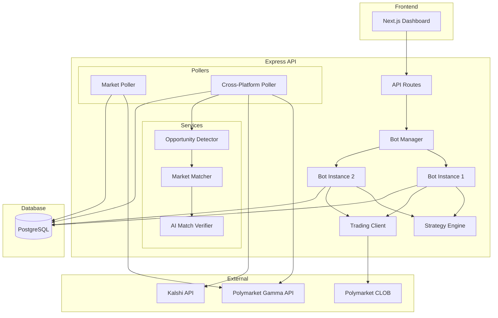

# AGENTS.md

> AI Coding Assistant Guidelines for the Polymarket Trading Bot

This document provides context and guidelines for AI coding assistants working on this codebase.

---

## Project Overview

**Polymarket Trading Bot** is an autonomous trading system that scans high-liquidity, near-resolution prediction markets on Polymarket, invests a constant $1 per bet, and aims to deploy $150 per day by prioritizing opportunities with the highest profit-per-hour (PPH). The system includes cross-platform arbitrage detection between Polymarket and Kalshi.

### Architecture

This is a **Turborepo monorepo** with the following structure:

```
polymarket-mvp/
├── apps/
│   ├── api/          # Express.js backend (trading bot, market scanning, APIs)
│   ├── vault-api/    # Express.js backend (vault management + custom redemption flow)
│   ├── vault-web/    # Next.js vault dashboard frontend
│   └── web/          # Next.js dashboard frontend (shadcn/ui)
├── contracts/        # Vault smart contracts and deployment scripts (Foundry)
├── packages/
│   ├── ui/           # Shared UI components (shadcn/ui)
│   ├── eslint-config/
│   └── typescript-config/
```

For all vault-related work, read `VAULT_KNOWLEDGE.md` first.

Vault-specific rules that are easy to get wrong:

- Discover currently renders a static empty state while the backend is intentionally offline. Do not mount discovery queries or wallet authentication on `/discover` until live vaults are re-enabled.
- The active custom vault flow uses `FlatBookVaultV2` semantics, not `ClosedBookBatchVault` and not `EpochTrancheVault`.
- In the active `FlatBookVaultV2` contract version, processed queued deposits auto-mint ERC20 shares during `processDeposits()`; do not show a manual processed-deposit claim step for new deposits.
- Custom-vault NAV/share pricing must exclude queued deposits and redemption liabilities. Never price custom vaults from raw `totalAssets / totalSupply` when a liability-adjusted source exists.
- Address normalization matters in vault DB projections. Use case-insensitive/normalized address handling for vault and user address lookups.

### Key Components

| Component               | Location                                         | Purpose                                     |
| ----------------------- | ------------------------------------------------ | ------------------------------------------- |
| Trading Bot             | `apps/api/src/bot/`                              | Autonomous betting engine with PPH strategy |
| Bot Manager             | `apps/api/src/bot/botManager.ts`                 | Multi-bot instance orchestration            |
| Bot Configs             | `apps/api/src/bot/config/`                       | Per-bot configuration (modular structure)   |
| Strategy Engine         | `apps/api/src/bot/strategyEngine.ts`             | PPH scoring and opportunity evaluation      |
| Trading Client          | `apps/api/src/bot/tradingClient.ts`              | Polymarket CLOB order placement             |
| Market Poller           | `apps/api/src/services/marketPoller.ts`          | Background market data fetching             |
| Cross-Platform Detector | `apps/api/src/services/crossPlatformDetector.ts` | Polymarket ↔ Kalshi arbitrage               |
| AI Match Verifier       | `apps/api/src/services/aiMatchVerifier.ts`       | AI-powered market matching verification     |
| API Routes              | `apps/api/src/routes/`                           | REST API endpoints                          |
| Dashboard               | `apps/web/`                                      | Web UI for monitoring                       |

---

## Setup Commands

```bash
# Install dependencies
pnpm install

# Development (runs both API and web)
pnpm dev

# Build all packages
pnpm build

# Lint
pnpm lint

# Format code
pnpm format

# Database migrations (from apps/api)
cd apps/api && pnpm db:generate && pnpm db:migrate
```

---

## Coding Style & Conventions

### TypeScript

- **Strict mode** enabled across all packages
- Use **ES modules** (`type: "module"` in package.json)
- File extensions required in imports: `./file.js` (even for .ts files)
- Prefer `interface` over `type` for object shapes
- Use `const` assertions for literal types: `as const`

### Naming Conventions

| Type             | Convention       | Example                                 |
| ---------------- | ---------------- | --------------------------------------- |
| Files            | camelCase        | `tradingBot.ts`, `marketPoller.ts`      |
| Classes          | PascalCase       | `TradingBot`, `StrategyEngine`          |
| Functions        | camelCase        | `calculatePPH`, `evaluateOpportunities` |
| Constants        | UPPER_SNAKE_CASE | `BOT_CONFIG`, `DEFAULT_MODE`            |
| Types/Interfaces | PascalCase       | `ScoredOpportunity`, `BotStatus`        |

### Code Organization

- Keep related code in feature directories (`bot/`, `services/`, `clients/`)
- Use barrel exports via `index.ts` files
- Colocate types with their implementation or in a `types.ts` file
- Repository pattern for database access (`db/repositories/`)

### Error Handling

- Use structured logging via `logger.ts`
- Include error context: `{ error: (error as Error).message }`
- Return `{ success: boolean, error?: string }` patterns for fallible operations

---

## Key Technical Details

### Trading Bot Strategy (PPH - Profit Per Hour)

The bot uses a "Fast Money" strategy that prioritizes capital velocity:

```typescript
PPH = (Profit if Win) / (Hours Until Close)
```

**Rules:**

- 95-99¢ odds: Allowed if resolving within 24 hours
- 99-99.5¢ odds: Allowed only if resolving within 6 hours
- Above 99.5¢: Skip (too close to $1, no meaningful profit)

**Hard-coded Safety Limits (in `bot/config/bots/bot1-default.ts`):**

- `betSize: 5.00` - Fixed $5 per bet (configurable per bot)
- `dailyBudget: Infinity` - No limit by default (configurable per bot)
- `minWalletReserve: 0` - No reserve by default
- `maxDailyLoss: Infinity` - No limit by default (configurable per bot)

### Multi-Bot Configuration

The system supports running **multiple bot instances** simultaneously, each with:

- Different strategy parameters (odds ranges, time thresholds)
- Different wallet accounts (separate private keys)
- Independent daily budgets and tracking

Bot configurations are defined in `apps/api/src/bot/config/`:

```
src/bot/config/
├── index.ts          # Main exports + helper functions
├── types.ts          # BotInstanceConfig interface (all fields required)
└── bots/
    ├── index.ts      # Aggregates all bot configs + validation
    ├── bot1-default.ts  # Bot 1 configuration
    ├── bot2-aggressive.ts  # Bot 2: Lower odds, fast resolution
    └── bot3-safe.ts     # Bot 3: High odds, very fast resolution
```

**Each bot config is fully explicit** - no inheritance between bots.
All fields in `BotInstanceConfig` must be specified in each bot file.

To add a new bot:

1. Create `bot{N}-{name}.ts` in `config/bots/`
2. Copy all fields from an existing bot and modify as needed
3. Import and add to `BOT_CONFIGS` array in `config/bots/index.ts`
4. Set environment variables for the wallet

Example bot config:

```typescript
// config/bots/bot2-aggressive.ts
import { env } from "../../../env.js";
import type { BotInstanceConfig, BotMode } from "../types.js";

const config: BotInstanceConfig = {
  id: 2,
  name: "aggressive",
  enabled: false,
  walletPrivateKeyEnv: "WALLET_2_PRIVATE_KEY",
  walletFunderAddressEnv: "WALLET_2_FUNDER_ADDRESS",
  betSize: 5.0,
  dailyBudget: Infinity,
  minOdds: 0.9,
  maxOdds: 0.995,
  maxHoursGeneral: 3,
  // ... all other required fields
  defaultMode: (env.BOT_MODE || "simulation") as BotMode,
};

export default config;
```

### API Clients

| Client           | Base URL                           | Purpose                              |
| ---------------- | ---------------------------------- | ------------------------------------ |
| Polymarket Gamma | `https://gamma-api.polymarket.com` | Market data, probabilities           |
| Polymarket CLOB  | `https://clob.polymarket.com`      | Order book, trade execution          |
| Kalshi           | Kalshi API                         | Competitor market data for arbitrage |

### Database

- **ORM**: Drizzle ORM with PostgreSQL
- **Schema**: `apps/api/src/db/schema.ts` (cross-platform), `apps/api/src/db/botSchema.ts` (bot positions)
- **Repositories**: Abstraction layer in `db/repositories/`

### Environment Variables

Required variables (see `apps/api/src/env.ts`):

```
DATABASE_URL               # PostgreSQL connection string
POLYMARKET_PRIVATE_KEY     # Primary wallet for live trading
POLYMARKET_FUNDER_ADDRESS  # Primary wallet funder address
OPENAI_API_KEY             # (Optional) For AI match verification
BOT_MODE                   # "simulation" | "live"

# Additional wallets for multi-bot (optional)
WALLET_2_PRIVATE_KEY       # Second bot wallet
WALLET_2_FUNDER_ADDRESS    # Second bot funder address
```

---

## Testing

```bash
# Run API in development (includes hot reload)
cd apps/api && pnpm dev

# Check TypeScript types
pnpm build

# Test API endpoints
curl http://localhost:8080/health
curl http://localhost:8080/cross-platform
curl http://localhost:8080/bot/status
```

### Key API Endpoints

| Endpoint                         | Method | Description                             |
| -------------------------------- | ------ | --------------------------------------- |
| `/health`                        | GET    | Server health check                     |
| `/cross-platform`                | GET    | Active arbitrage opportunities          |
| `/opportunities/near-resolution` | GET    | High-confidence near-resolution markets |
| `/bot/status`                    | GET    | Default bot status (bot ID 1)           |
| `/bot/instances`                 | GET    | List all bot instances with status      |
| `/bot/:botId/status`             | GET    | Specific bot status                     |
| `/bot/:botId/scan`               | POST   | Run scan for specific bot               |
| `/bot/scan-all`                  | POST   | Run scan for all enabled bots           |
| `/bot/check-resolutions-all`     | POST   | Check resolutions for all bots          |
| `/bot/mode`                      | POST   | Switch simulation/live mode             |

---

## Important Notes

### Do's

- ✅ Always run `pnpm build` to verify TypeScript compilation
- ✅ Update this file when adding new features or changing architecture
- ✅ Use the existing logger (`import { logger } from "./logger.js"`)
- ✅ Follow the repository pattern for new database operations
- ✅ Keep safety limits in `bot/config/bots/bot1-default.ts` as constants (not env vars)

### Don'ts

- ❌ Do NOT modify safety limits without explicit user approval
- ❌ Do NOT remove simulation mode safeguards
- ❌ Do NOT hardcode API keys or secrets (use env vars)
- ❌ Do NOT change the bet size without explicit approval
- ❌ Do NOT bypass the daily budget limit

---

## Recent Changes

<!-- This section should be updated after each significant change -->

| Date       | Change                                                                                              | Files Affected                                                                                                                                                                                            |
| ---------- | --------------------------------------------------------------------------------------------------- | --------------------------------------------------------------------------------------------------------------------------------------------------------------------------------------------------------- |
| 2026-04-29 | Added helper-enabled FlatBookVaultV2 rollout path for atomic USDC.e deposit/claim UX                | `contracts/src/FlatBookVaultV2.sol`, `contracts/scripts/deployFlatBookVaultV2.js`, `apps/vault-api/src/scripts/*`, `apps/vault-web/*`, `VAULT_KNOWLEDGE.md`                                               |
| 2026-04-29 | Migrated vault backend collateral config to pUSD/CLOB V2 and generic collateral labeling            | `apps/vault-api/src/config/network.ts`, `apps/vault-api/src/constants.ts`, `apps/vault-api/src/services/*`, `apps/vault-api/src/routes/*`, `apps/vault-api/src/scripts/*`                               |
| 2026-04-28 | Added vault migration mode to pause new USDC.e deposits while preserving withdrawals/claims/activity | `apps/vault-api/src/config/*`, `apps/vault-api/src/routes/*`, `apps/vault-api/src/services/vaultProvider.ts`, `apps/vault-web/*`                                                                          |
| 2026-03-23 | Fixed FlatBookVaultV2 processed-deposit flow, liability-aware NAV, and claim UX/documentation       | `apps/vault-api/src/services/navOracle.ts`, `apps/vault-api/src/routes/customVaultRoutes.ts`, `apps/vault-api/src/services/customVaultProvider.ts`, `apps/vault-web/*`, `VAULT_KNOWLEDGE.md`, `AGENTS.md` |
| 2026-03-12 | Hardened closed-book lifecycle: permissionless state-gated maintenance, no route-driven progression | `contracts/src/ClosedBookBatchVault.sol`, `contracts/test/ClosedBookBatchVault.t.sol`, `apps/vault-api/src/routes/*`, `apps/vault-api/src/services/customVaultProvider.ts`                                |
| 2026-01-01 | Refactored bot config into modular structure with strict validation                                 | `bot/config/*`, removed `bot/botConfigs.ts`                                                                                                                                                               |
| 2025-01-01 | Optimized multi-bot scans: fetch markets once, run all bots in parallel                             | `bot/botManager.ts`, `bot/tradingBot.ts`, `cron/runTradingBot.ts`                                                                                                                                         |
| 2024-12-31 | Added multi-bot support with BotManager and per-bot configurations                                  | `bot/botConfigs.ts`, `bot/botManager.ts`, `bot/routes.ts`, `botSchema.ts`                                                                                                                                 |
| 2024-12-22 | Added cron-friendly endpoints `/bot/scan` and `/bot/check-resolutions`                              | `bot/routes.ts`, `bot/tradingBot.ts`, `bot/resolutionChecker.ts`                                                                                                                                          |
| 2024-12-22 | Added resolution checker to track position outcomes and calculate USD P/L                           | `bot/resolutionChecker.ts`, `clients/polymarketClient.ts`, `index.ts`                                                                                                                                     |
| 2024-12-22 | Relaxed 99¢+ time threshold from 3h to 6h                                                           | `bot/config.ts`                                                                                                                                                                                           |
| 2024-12-22 | Added max investment stats (maxInvestment, maxProfitPercent, maxProfitAbsolute)                     | `bot/types.ts`, `bot/strategyEngine.ts`                                                                                                                                                                   |
| 2024-12-22 | Initial AGENTS.md creation                                                                          | `AGENTS.md`                                                                                                                                                                                               |

---

## Architecture Diagram



---

## Contact

For questions about this project, refer to the conversation history or ask the user directly.
